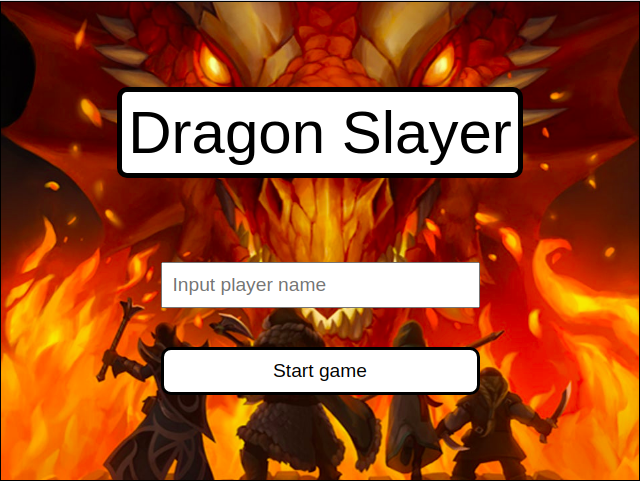

# JavaScript Capstone

#### Hello there! Welcome to my first video game! This game consists of a turn based RPG, where the player gets to walk around the world and fight dragons!

#### Features
- Input player's name
- Walk around in open world
- Find and fight enemies
- Set score to service API

#### Screenshot



#### Livedemo

- [Netlify](https://peaceful-albattani-870785.netlify.app/)

#### Game Design Document

- [Google Docs](https://docs.google.com/document/d/1GLcpJxP0M5cHwXf-yC_D5HH3tL8cHOpvj0sXMWkMjpU/edit?usp=sharing)

## Built With

- [JavaScript](https://www.javascript.com/)
- [NPM](https://www.npmjs.com/)

## Packages
- [Babel](https://babeljs.io/)
- [Core JS](https://www.npmjs.com/package/core-js)
- [CSS Loader](https://webpack.js.org/loaders/css-loader/)
- [Eslint](https://eslint.org/)
- [File Loader](https://webpack.js.org/loaders/file-loader/)
- [Phaser](https://phaser.io/)
- [Style Loader](https://webpack.js.org/loaders/style-loader/)
- [Stylelint](https://stylelint.io/)
- [Webpack](https://webpack.js.org/)

## Getting started

### Playing

##### In the open world:
- Use the arrow keys to move your character

##### In a battle
- Use the arrow keys to change options, use the space bar to select

### Setup

Clone the repo with

```
  https://github.com/tadeuasarro/JSCapstone.git
```

Install packages with

```
  npm install
```

Start server with:

```
    npm run start:dev
```

Open `http://localhost:9000/` in your favorite browser.

### Run tests

```
    npm run test
```

### Authors

👤 This is me:

- [Tadeu A Sarro](https://tadeuasarro.me)


### Contributing

Contributions, issues and feature requests are welcome!

Feel free to check the [issues page](https://github.com/tadeuasarro/JSCapstone/issues)


### Show your support

Give a star if you like this project!

### Acknowledgments

- [Game Dev Academy](https://gamedevacademy.org/)
- [Microverse](https://www.microverse.org/)

### 📝 License

This project is MIT licensed.